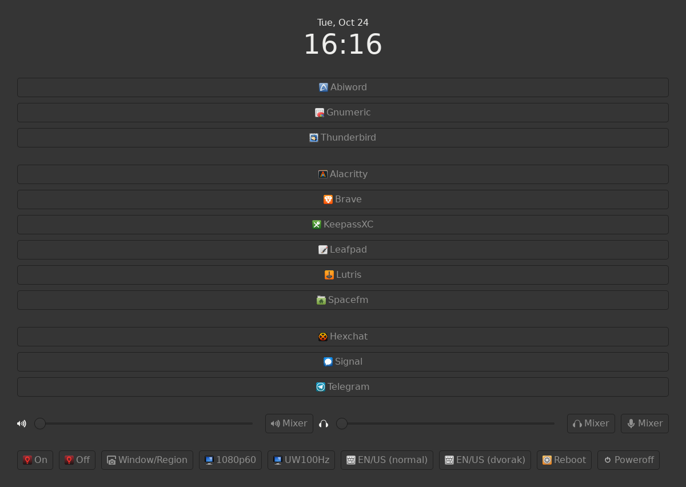

# knobs

A framework for creating custom dashboards and launchers for Linux. Works under
X11, should work under Wayland (but that is not tested).

**Warning: knobs is, at best, beta quality software. I use it everyday as my
only launcher and dashboard, but some features are missing and there might be
edge cases that my usage pattern hasn't yet bumped into.**

## Why?

Most launchers Linux launchers do not fit my use case. They're either too
complicated and bloated, or they are too simplistic and lack features and
flexibility.

## What can knobs do that other launchers can't?

- It can create and display controls other than buttons and menus to click:
  layout boxes, icons and sliders/scales are also available;

- It is written in C++ as a set of wrappers around gtkmm, so the startup time
  is next to nothing, memory usage is very modest, and you probably already
  have its dependencies installed anyway.

As an example, here's my one of my configs for knobs:



## Dependencies

You'll need to have a c++17 capable C++ compiler (tested with GCC), and the
development libraries for gtkmm-4.0 and its dependencies (pango, cairo, etc.).

On Arch or derivatives, the necessary development libraries are (as given by
`pkg-config --libs gtkmm-4.0`):

```
cairo
cairo-gobject
cairomm-1.16
gdk\_pixbuf-2.0
gio-2.0
giomm-2.68
glib-2.0
glibmm-2.68
gobject-2.0
graphene-1.0
gtk-4
gtkmm-4.0
harfbuzz
pango-1.0
pangocairo-1.0
pangomm-2.48
sigc-3.0
```

## Installation and usage

The first thing to note is that what is provided is not a finished program, but
a framework. Right after cloning the repo, `make` will fail. This is expected.

knobs is configured via a config.hpp (like dwm). An example config.def.hpp is
provided for suggestions and examples for how to make your own dashboards. Use
the examples to build your own dashboard or launcher according to your needs.

## Quick widget reference

- Containers:

    - ui::BoundingBox(margin): A vertical box with 0 spacing between children
      but *margin*px spaces around its contents;

    - ui::HBox(spacing), ui::VBox(spacing): horizontal and vertical layout
      boxes, with no margins but *spacing*px beteen child widgets;

- Leaf Widgets:

    - ui::Button(label, icon, callback): A button labeled *label*, and *icon*
      to the left of the text, where *icon* is not a path, but an icon name;
      *callback* will be invoked with no arguments when the button is clicked;
      both *label* and *icon* are optional, but at least one should be provided;

    - ui::Icon(name): an icon from your OS's available icon set;

    - ui::Label(markup): an updatable text label that accepts pango markup;

    - ui::HScale(min, max, callback), ui::VScale(min, max, callback):
      horizontal and vertical slider scales that go from *min* to *max*; each
      update of the slider causes callback to be called with an argument of
      type double that matches where the slider is on the scale;

